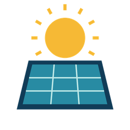

# PV Sunshine



**Turn your solar panels into a local sunshine sensor for Home Assistant.**

[](https://my.home-assistant.io/redirect/hacs_repository/?owner=toak&repository=ha-pv-sunshine&category=integration)

PV Sunshine compares measured PV production with an approximate clear-sky reference for your roof. Use the resulting signals for blinds, shading and other building automations. It works with any inverter integration exposing production power in W or kW. The PV model makes no cloud calls and needs no API keys or runtime downloads. Optional weather enrichment reuses an existing HA weather integration.

> These are sunlight **estimates**, not measurements of cloud cover or direct irradiance. Curtailment, clipping, snow, shadows and inverter faults can look like clouds. Start by observing the sensors before connecting them to moving blinds.

## Why PV Sunshine exists

The idea grew out of using [Adaptive Cover by basbruss](https://github.com/basbruss/adaptive-cover) to manage blinds. In the installation that inspired this project, cloud-based weather data did not always match the sunshine at the house: the blinds sometimes closed for sun protection even though it was not sunny locally.

PV Sunshine aims to provide the most accurate and timely **local sunshine signal possible from the available sensors**, so shading decisions reflect what is happening at the building. Actual PV production supplies local evidence that a remote weather report can miss. This is an accuracy goal, not a guarantee: PV output alone cannot distinguish every cloud from shading, snow or inverter curtailment, and it does not measure general weather conditions.

Adaptive Cover is the inspiration and a potential consumer of these signals; PV Sunshine remains an independent integration. Compatibility with a particular cover controller's input format must be configured and verified separately.

### Enrich regional weather with local sunshine

From **v0.2.1**, initial setup offers a **Weather enrichment** step after your PV planes. Select an existing Home Assistant weather entity, or leave the selection empty and submit to finish with PV sensors only. For existing installations, use **PV Sunshine → Configure → Weather enrichment** to enable or change it. This creates **Local weather**, normally `weather.pv_sunshine_local_weather`, which you can select as the weather input in your cover controller. Entity IDs depend on your installation name and existing entities; use the actual ID shown by Home Assistant.

For example, your provider can report `partlycloudy` while PV Sunshine reports `sunny` or `cloudy` based on stable local PV evidence. This **enriches** regional weather; it does not average the two sources or convert PV power into a cloud-cover percentage.

- Stable local sky detection refines `sunny`, `partlycloudy`, `cloudy` and daytime `clear-night` reports. A sunny override also requires the fast direct-sun signal to be on; a cloudy override requires it to be off. Startup and transitions retain the provider condition until evidence agrees.
- Rain, snow, fog, wind, storms and other non-sky conditions remain from the provider. The `local_sky_condition` attribute still exposes the local observation alongside them.
- Temperature, humidity, wind, pressure and other supported weather measurements retain the provider values, with normal HA unit conversion. `cloud_coverage` remains the provider's regional estimate, even when local sunshine differs.
- Daily, hourly and twice-daily forecasts are forwarded when the source supports them. **PV does not rewrite forecasts.** Forecasts are requested through HA's weather service; active forecast subscribers refresh every ten minutes. The original weather integration remains responsible for its API access and caching.
- When PV is unavailable, too weak, warming up or nighttime, the entity falls back to fresh provider conditions. It never infers a clear night from zero PV output. Missing/stale provider measurements are not copied; valid local daytime sunshine can still be reported without them. When neither source supports a condition, the entity is unavailable.

The **weather report freshness timeout** defaults to one hour and uses the last report to HA. Adjust it to your provider's update interval. An upstream service that repeatedly reports cached data can still appear fresh.

An optional **PV inference blocked / curtailment sensor** disables PV overrides when it is `on`, unknown, unavailable or missing. Select a binary sensor that indicates unreliable production, such as active export limiting. Only an explicit `off` permits local enrichment. This does not automatically detect curtailment, and it affects the enriched weather entity only; the original PV entities remain unchanged.

Attributes explain every decision:

| Attribute | Meaning |
| --- | --- |
| `original_condition` | Fresh provider condition before enrichment |
| `condition_source` | `pv`, `weather` or `none` |
| `sunshine_confidence` | `local_estimate`, `provider_only` or `unavailable`; qualitative, not a probability |
| `enrichment_reason` | Why local evidence or fallback was used |
| `local_sky_condition` | Stable PV sky classification, independent of provider rain/wind |
| `weather_source_available` | Whether provider state is recognized and fresh |

For Adaptive Cover, select the new weather entity in its climate settings and configure which conditions count as sunny. Inspect the behavior before enabling blind movements. No cover-controller settings are changed automatically. Clear the optional weather selection to remove the enriched entity; the local PV sensors continue to work. No additional API account is needed. Local light-sensor fusion and automatic curtailment detection remain future work.

## Requirements and installation

- Home Assistant **2026.9.0 or later**; tested with 2026.9.4 / Python 3.14.
- One production **power** sensor for each separately metered PV plane, in W or kW. Do not use energy (kWh), grid export, net power or battery power.
- Accurate Home Assistant location, plus each plane's azimuth, tilt and installed panel peak power.

### HACS custom repository

Click **Open in HACS** above, choose your Home Assistant instance, then confirm the repository and download in HACS. HACS must already be installed. Restart Home Assistant after downloading, then add **PV Sunshine** under Devices & services. The button opens the installation screen; it cannot silently install or restart your instance.

If you prefer the manual route, add `https://github.com/toak/ha-pv-sunshine` in **HACS → ⋮ → Custom repositories**, category **Integration**. Download PV Sunshine and restart Home Assistant. This is a custom repository; availability in the default HACS catalogue requires separate review and is not implied.

### Manual installation

Copy `custom_components/pv_sunshine` into your Home Assistant `config/custom_components/` directory and restart. Go to **Settings → Devices & services → Add integration → PV Sunshine**.

## Set up your planes

1. Name the installation.
2. Select an existing PV power sensor and give the plane a meaningful name (for example, East roof).
3. Enter azimuth (north 0°, east 90°, south 180°, west 270°), tilt (0° horizontal, 90° vertical) and installed panel power in kWp.
4. Start with performance factor **0.85**. This scales the model for system losses and can be adjusted after observing a clear day.
5. Add more planes if they have their own independent power sensors.
6. On the **Weather enrichment** screen, optionally select your existing weather entity. Leave it blank and submit to skip enrichment.

For example, 11 × 450 W panels correspond to **4.95 kWp**, regardless of the inverter's nominal rating. Use your actual panel rating. Do not assign the same sensor twice, or combine an inverter total with the strings it already includes. The UI rejects an identical source assigned twice within an installation; it cannot detect overlapping sensors from different integrations.

If you have only a total power sensor for a mixed east/west roof, v0.1 cannot accurately separate those planes. Do not invent per-plane measurements: use a single approximate plane with reduced confidence, or obtain separate MPPT power entities first.

Use **Configure** on the integration to adjust detection, add planes, edit geometry or replace source sensors. Edits preserve entity unique IDs. Removing a plane removes its entities. Sensor entity IDs renamed in HA must also be updated here.

## Entities

The installation and **each plane** expose:

| Entity | Meaning |
| --- | --- |
| Actual PV power | Current valid production, W |
| Expected clear-sky PV power | Local model baseline, W; available even if source telemetry is missing |
| Clear-sky ratio | Actual / expected, **fraction**; 0.8 = 80%; can exceed 1 |
| Sunshine index | Smoothed ratio, limited to 0–100%; not a probability or cloud-cover percentage |
| Sky condition | `sunny`, `partly_cloudy`, `cloudy`, `night`, `insufficient_light` |
| Direct sun | Fast estimate using raw ratio, hysteresis and on/off delays |

Four more direct-sun entities gate the aggregate estimate by north/east/south/west **vertical facade geometry**. Per-plane direct sun instead uses that plane's tilt and azimuth. A west facade and a west-facing roof are different surfaces. Directional entities do not model trees, overhangs, window orientation or neighbouring buildings. `quality` attributes explain `ok`, `night`, `insufficient_light` or `source_unavailable`.

An optional **Local weather** entity enriches an existing weather source as described above. PV output alone does not establish rain, temperature, wind or clear night skies.

## Detection defaults

| Setting | Default | Purpose |
| --- | --- | --- |
| Smoothing time constant | 60 s | Time-based EMA for index and stable sky |
| Direct sun on / off ratio | 0.75 / 0.60 | Hysteresis on the raw fraction |
| Direct sun on / off delay | 10 s / 30 s | Reject brief changes |
| Stable condition delay | 120 s | Candidate must persist before changing sky state |
| Source freshness timeout | 300 s | Uses HA's last reported timestamp, even if value stayed constant |
| Minimum sun elevation | 5° | Avoid unreliable low-angle inference |
| Minimum expected fraction | 0.03 | At least 3% of peak power and at least 20 W |

Source state changes update immediately; a five-second clock handles dwell times, sun movement and freshness. Delays can therefore finish up to five seconds after their threshold, and detection is always limited by the source's reporting interval. A cloud-polled inverter does not become a fast local sensor merely by installing this integration.

During initial warm-up, direct sun and stable sky remain unavailable until their respective delays finish. Missing, stale, non-finite or unsupported-unit readings invalidate affected power/inferences and reset their timers. One missing plane invalidates aggregate actual power and aggregate inference; healthy planes continue independently. At night, expected power is zero, index zero, direct sun off and condition `night`, even if the inverter sleeps; ratio remains unavailable. Low daylight produces `insufficient_light`, with ratio/index/direct sun unavailable.

Small negative readings down to −50 W are clamped to zero to tolerate idle offsets. More negative values are rejected. A source that keeps reporting a frozen value cannot be diagnosed from HA timestamps alone.

## Blinds example

Replace these entity IDs with those created in your installation. This example only lowers a west blind after sustained direct sun; it does not automatically reopen it on missing data. Add your own occupancy, manual override, temperature, wind and window controls as appropriate.

```yaml
alias: Shade west window on direct sun
triggers:
  - trigger: state
    entity_id: binary_sensor.pv_sunshine_direct_sun_west
    to: "on"
    for: "00:01:00"
conditions:
  - condition: numeric_state
    entity_id: sensor.living_room_temperature
    above: 24
actions:
  - action: cover.set_cover_position
    target:
      entity_id: cover.west_blind
    data:
      position: 30
mode: single
```

Keep unknown/unavailable distinct from off in your automations. Tune and observe across several clear and cloudy days. On a genuinely clear, uncurtailed day, a consistently low ratio can indicate that the performance factor is too high; a consistently high ratio can indicate that it is too low. A single correction cannot compensate for time-varying shade, temperature or clipping.

## Model, limitations and development

The first release uses Haurwitz global horizontal irradiance, a fixed approximate diffuse split and isotropic transposition to each plane. It uses Home Assistant's location and Astral solar position. It does not include atmospheric turbidity, panel temperature, snow, horizon masks, bifacial production, trackers or inverter clipping. See [model details and the learning extension](docs/algorithm.md), [research](docs/research.md), [quality notes](docs/quality.md) and [contributing](CONTRIBUTING.md).

Zero export limits, full batteries, grid limits or inverter derating can reduce production in full sun. PV alone cannot disambiguate these from clouds. Direct-sun entities are heuristic estimates, especially for flat roofs and diffuse-bright conditions. A dedicated irradiance sensor may be more appropriate where misclassification matters.

## Troubleshooting and privacy

- **Unavailable:** check source state, W/kW units, freshness and minimum sunlight. A source with a reporting interval longer than five minutes needs a longer freshness timeout.
- **Too often cloudy:** confirm panel kWp and geometry, inspect curtailment/shading, then compare the clear-sky baseline with measured power on a clear day.
- **Too often sunny:** check for overlapping sources or an underestimated reference curve.
- **Blinds react too often:** lengthen the off delay or use a longer automation `for` duration.
- **After changes:** configuration updates reload the integration and reset smoothing and pending timers.

Download diagnostics from the integration menu. They contain model settings, plane geometry and current readings but omit coordinates, installation/plane names and source entity IDs. Review diagnostics before sharing; production values and roof geometry are still information about your home. PV Sunshine does not upload your PV measurements. When enrichment is enabled, the selected weather integration retains its own API access and privacy behavior. Home Assistant may retain entity history according to your Recorder configuration.

## License

MIT. This is an independent community custom integration, not an official Home Assistant or inverter-vendor product.
